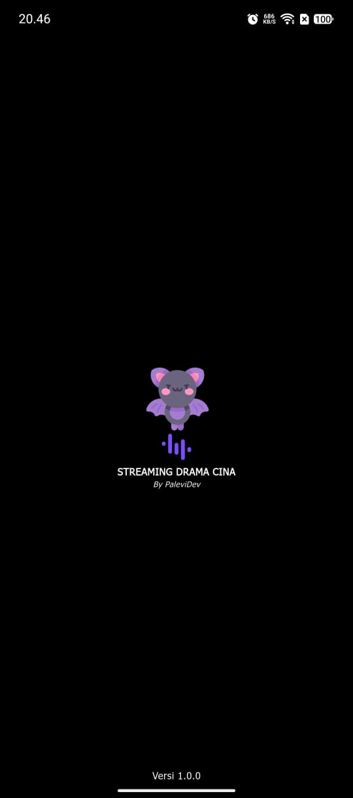
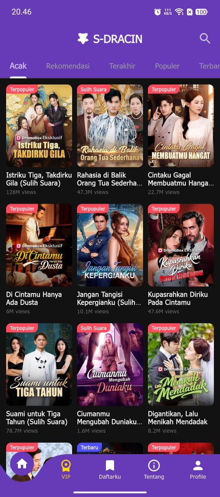
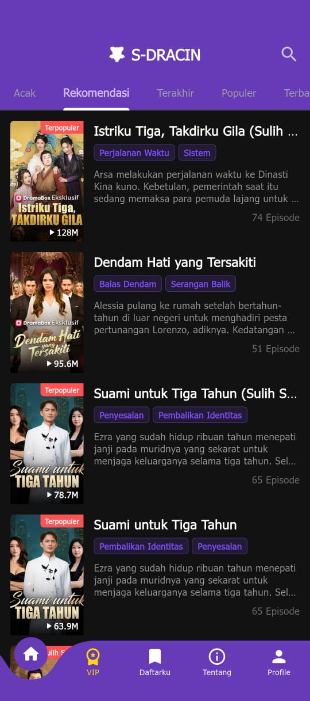
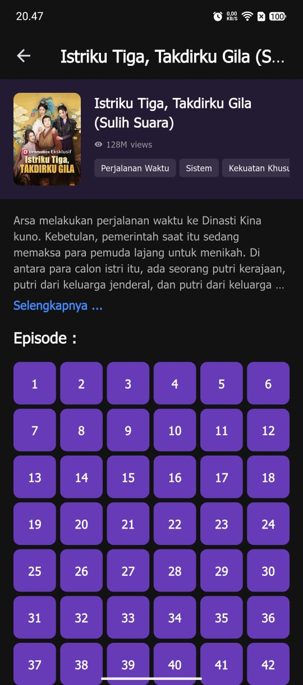
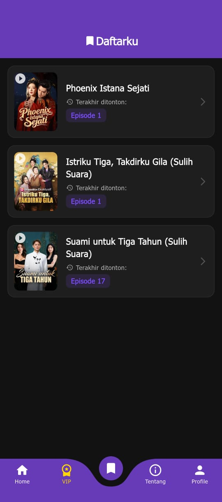
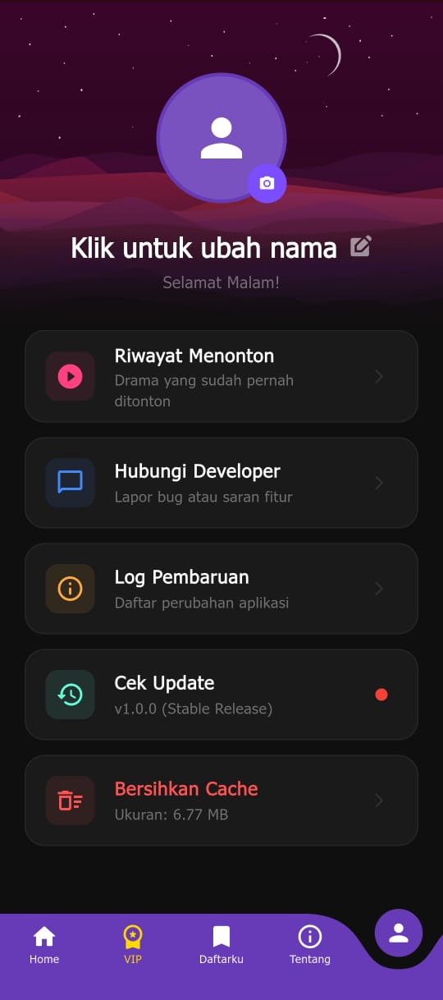

<h1 align="center">🎬 S-DRACIN</h1>

  <strong>Aplikasi Streaming Drama Modern dengan Akses VIP Gratis</strong>

  Nikmati pengalaman menonton drama favorit dengan antarmuka elegan, performa ringan,  
  dan fitur VIP yang dapat diakses <strong>tanpa biaya</strong>.

<h2>✨ Tentang Aplikasi</h2>

  <strong>S-DRACIN</strong> adalah aplikasi streaming drama yang dirancang dengan fokus pada
  kenyamanan pengguna, tampilan modern, dan kemudahan akses.
  Aplikasi ini memungkinkan pengguna menikmati konten drama berkualitas
  dengan fitur <strong>VIP Free Access</strong>, tanpa langganan dan tanpa batasan.

  Dengan sistem navigasi yang intuitif, tampilan visual yang bersih,
  serta manajemen daftar tontonan pribadi, S-DRACIN memberikan pengalaman
  menonton yang premium untuk semua pengguna.

<h2>📱 Tampilan Aplikasi</h2>

  
  
  
  

  <em>Splash Screen & Halaman Utama</em>

 

  
  

  <em>VIP Screen</em>

 

  
  

  <em>Daftarku & Profil Pengguna</em>

<h2>🚀 Fitur Unggulan</h2>

<ul>
  <li>🎥 Streaming drama dengan kualitas 1080p</li>
  <li>⭐ Akses <strong>VIP Gratis</strong> tanpa berlangganan</li>
  <li>📌 Fitur <strong>Daftarku</strong> untuk menyimpan drama favorit</li>
  <li>🕒 Riwayat tontonan otomatis</li>
  <li>🎨 UI modern, elegan, dan nyaman di mata</li>
  <li>⚡ Performa ringan & responsif</li>
</ul>

<h2>🎯 Tujuan Aplikasi</h2>

  S-DRACIN dikembangkan untuk memberikan solusi hiburan digital yang mudah diakses,
  bebas biaya, dan tetap menghadirkan pengalaman menonton yang berkualitas tinggi.
  Aplikasi ini cocok untuk pengguna yang menginginkan kenyamanan,
  kesederhanaan, dan fitur premium tanpa hambatan.

  <strong>✨ Selamat menikmati pengalaman menonton drama tanpa ribet! ✨</strong>

<h2>ℹ️ <strong>LOG LAST UPDATE HERE!</strong></h2>
<h2>🔄Update 1.1.0</h2>
<h1>Apa yang baru?</h1>

  Update kali ini menawarkan pembaruan dengan design yang sedikit di perbarui, memperbaiki beberapa
  bug issue serta improvement performance app selain itu ada penambahahan beberapa fitur baru yaitu :

<ul>
  <li>📌 add api melolo </li>
  <li>📌 add status api </li>
  <li>📌 peningkatan UI/UX </li>
  <li>📌 improvement performance </li>
  <li>📌 add buton next & prev episode </li>
  <li>📌 auto hide navbar system untuk meningkatkan kenyamanan visualisasi </li>
  <li>📌 integrasi API baru dengan daftarku dan riwayat tonton </li>
  <li>📌 add security patch 1.0.0 Beta and more </li>
</ul>

<h2>📱 Screenshot update 1.1.0 </h2>

  
  
  
  
  
  
  
  
  
  

